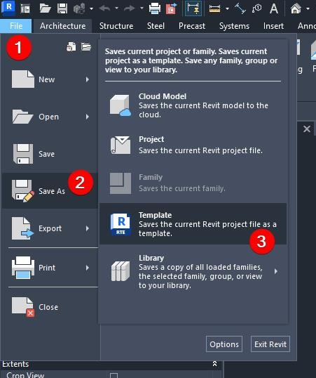
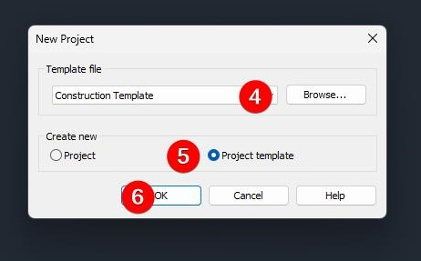
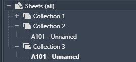

# Revit Template
Author: Julian Wandzilak  
find me at W7k.pl
License: CC BY-SA  
# About me  

  
  
My webpage:  
https://w7k.pl/  

  
  
More about my tools:  
https://apps.autodesk.com/en/Publisher/PublisherHomepage?ID=8UP2BABQLV9LA6YG

## Why templates? First Choices  
  
What kind of projects?  
What is the current project stage?  
How much time do you have?  
How much experience do you have in your current job?  
  
Write the answer down! Go to the project leaders for clarifications!  
  
Repetition vs Uniqueness  
Flexibility vs Control  
Newbies vs Experts  

#### CODE:
A - Architecture  
MEP - Mechanical, electrical and plumbing  
S - Structure  
L - Landscape  

## Creating a new template  
  
1. Buy it! 
2. From an existing project  
  
  
1. From default revit template  
  
  
  
1. Transfer Project standards from other projects

## Units  
  
Example of recommended unit setup for Length in metric system:
  
  
  
  
#### Setting units:  
4. Specific to the your country!  
5. Always rounding set to 3 decimal places. It forces people to be more precise while modelling.  
6. Set units. Personal choice. Feel free to show them.  
7. Hides trailing zeros. Works very well with point 5. Always on.  
8. Something worth using. Which one do you prefer? 1000000 vs 1 000 000.  
9. Specific to your country so choose it based on the local custom.  

## Project Browser
  
  

### Views
Keep it simple and don't go for anything more than 2 levels deep.  
BTW remember that changing it later changes it for everyone in the project!  

#### How to change it?  
  

1. Right click.  
2. Got To Browser Organization.  

  

3. Create a new organization scheme.  
4. Name it smartly!  
5. Click Edit.  
6. You can use this part to hide some views in your project browser. Objectively a waste of time - Why would you do this?  
7. Here we are organizing our structure. Use group by: Type  
8. Here you have more choices: Use group by: Family or by specific project parameter for views.  
9. Sort by View Name. Ascending.  

Some people use 3rd level: Group by Scale. Im not an enemy of it but not a big fan either.  

How does it works:

  
1. View Type. Make it generic like WIP, GA and avoid using things like WIP Plans. Remember to create the whole set (for plans, elevations and details) of these views in your template file! 
2. Family : Floor Plan, Section, Elevation, RCP etc. 

### Sheets
  
How many sheets do you plan to have?  
Sometimes not super obvious how to do it. Ideally you want to use you sheet number to divide your sheets into the series of drawings.  

For example here:

1. Group by: Sheet Number  
2. Choose leading characters..
3. Number of leading characters  

### Collections Revit 2025

  
I haven't seen anyone using it.  

### Some rules
Make sure to let your team know that BIM team during auditing/cleanup will delete:
1. Unnamed views so things like "Section 15" might disappear!  
2. Unassigned views with "?" will suffer a similar fate.  

## Parameters
### Project  
### Shared  

## Line Thicknesses  
### Default Line Thicknesses
  
  
  
### Do you really want to change it? Problems and personal choice?  
1. Different Setting in Linked Models (You will have to do it anyway as everyone is changing these!)  

2. Keep it simple!  
3. Changing Thicknesses in Scale is complicated so try to keep it simple! Default 1:100 everywhere is nice.  

4. Maybe 2 steps for drawings below 1:50 and above.  
5. Make a printout for your team with your lines.  
## Object Styles  
remember to change them especially after changing lines Thicknesses.  
### Understanding how it works
## Line styles  
Naming convention.Color vs Thicknesses vs Line Pattern!  
Please stop creating line types with names which convey information!  
  

How many lines? Depends on your settings.

Colours:  
* Black  
* Red  
* Green  
* Blue  
* Grey  
* Dark Grey  
* Cyan  
* Magenta  

Line Patterns:
* Solid  
* Dash 1.5 mm  
* Dash 3.0 mm  
* Dash Dot
* Dot

Good examples of names:  
1_Black_Solid  
4_Dash_Red  
Solid_5_Black  

## Line patterns
### Make it in Revit
Make sure the line is longer than 1/32" (about 0.78mm).  
### Importing from AutoCAD
Don't do it.  

## Do I need to change anything here?
### AEC UK BIM protocol
Worth checking:
https://aecuk.wordpress.com/documents/

## View Templates
### What is a View template 
View Template is a specific view saved in your file.  
View Template has the same settings as View has!  
  
  

View Templates has type. It doesn't mean you can't use plan template for section.  
Just make sure to later recreate a template as a new section template.  

### Creating view templates  

  

### Assigning view templates 

  

1. I haven't seen anyone doing it this way :)  
2. Normal way of doing it.  

### Controlling view templates:
Template name convention - Figure something!  

Good Examples:  
* WIP Plans 1 200  
* GA Sections 1 50 Detailed  
* GA_Plans_100  
  
  
  
To control disciples you need to create a view with specific disciple.  
Remember you can control these things globally with subcategories!  

#### View Properties worth to unclick  
Scale  
View Range  

Personal: Model Display  

#### Filters  

  
  
* Levels & Grids  
* RC  
* Hide views not of specific type  
* Fire Rating (A)  
* If you work with the same Architect, MEP or SE, create more filters!  

#### Linked Revit Files  
* File vs Instance

Better to use filters than to override too much.  

## Libraries
### Families  
#### Necessary: 
* Title blocks
  * Sheets
  * Issue/Project Page
#### Nice to have: 
* Materials
* Detail Components
* Components
* Doors (A)
* Windows (A)
* Curtain Walls (Mullions, Panels etc.)(A)
#### Depending on a workflow:
* Walls
* Floors
* Roofs
* Columns
* Stairs
* etc. 
### Typical details  
### System families
* Grids
* Levels
* Dimensions
* Spot Elevation
* Spot Coordinate
* Spot Slope
* Regions
* Text
* Tags
* Stair Path
* View Symbols (Elevations, Sections, callouts)
#### Dimensions
Tick Mark:  
Units:   Less precise  
#### Regions
Import from CAD  
    * "acad.pat"  
    * Open new project import cad and copy it  
Download from Internet  
pyRevit  
Code your pat files:  
https://help.autodesk.com/view/OARX/2025/ENU/?guid=GUID-A6F2E6FF-1717-44B6-A476-0CA817ADD77E  

#### Tags
Arrows:  
Parameters:  
#### View Symbols (Elevations, Sections, callouts)

## Views
### Preloading views 
### Schedules
#### Nice to have: 
* Door Schedule (A)
* Window Schedule (A)

## Sheets
Loaded sheets vs good sheet manual so people can create their own drawings
### Preloaded sheets - How to do it?
### Full set 

## MAKE A REVIT GUIDE!  
## MAKE A PROJECT GUIDE!  